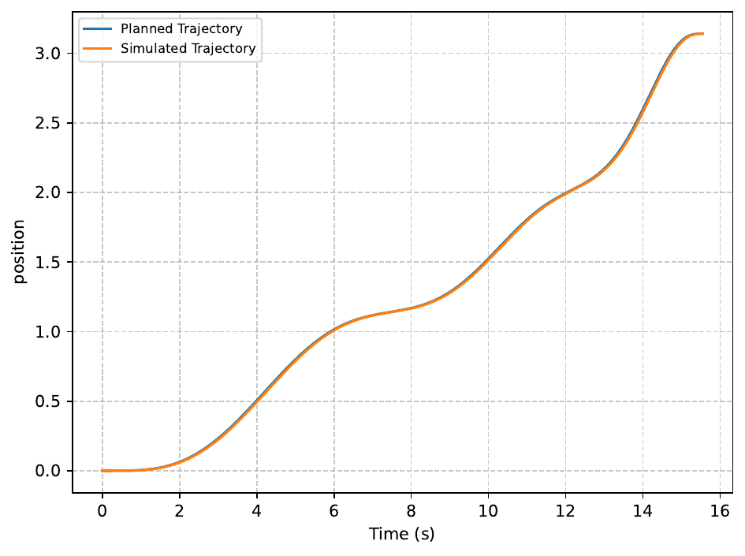
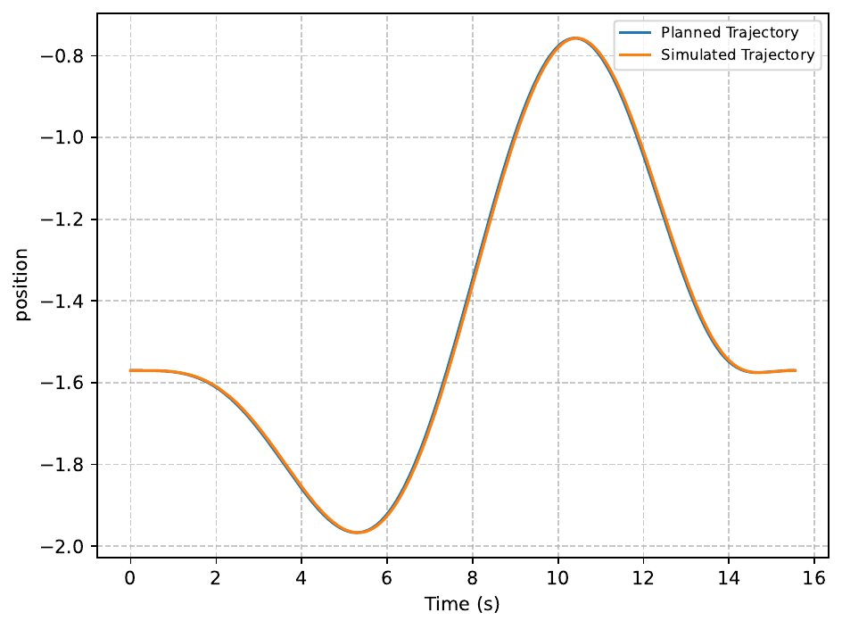
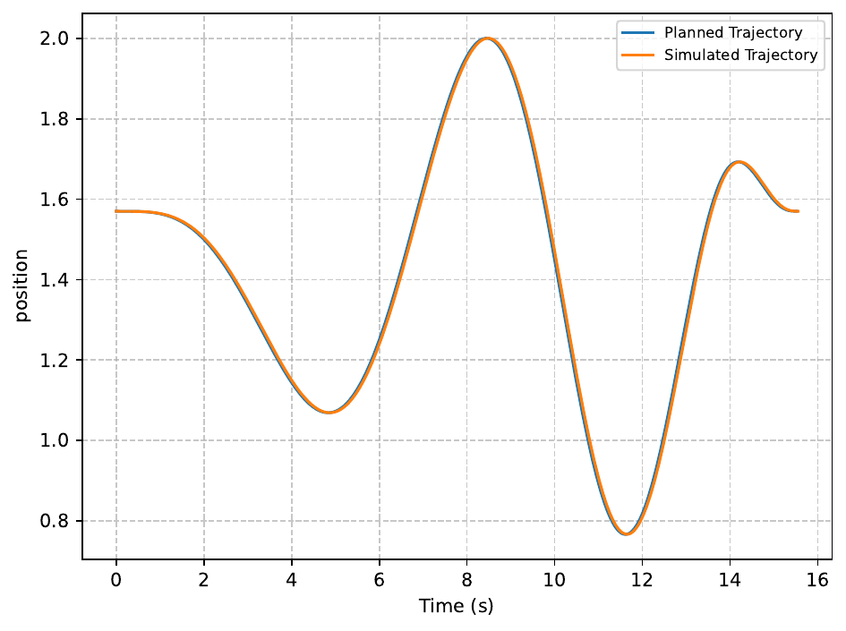
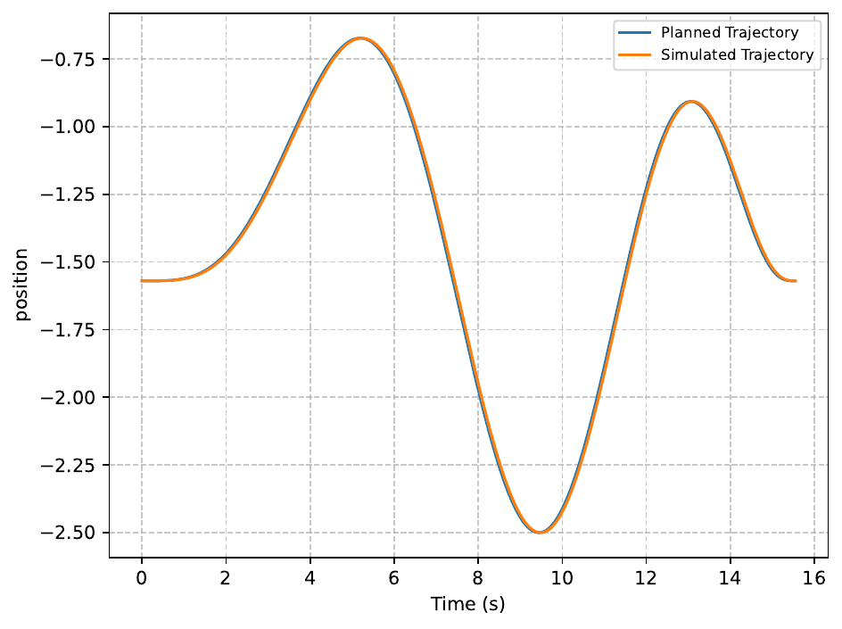
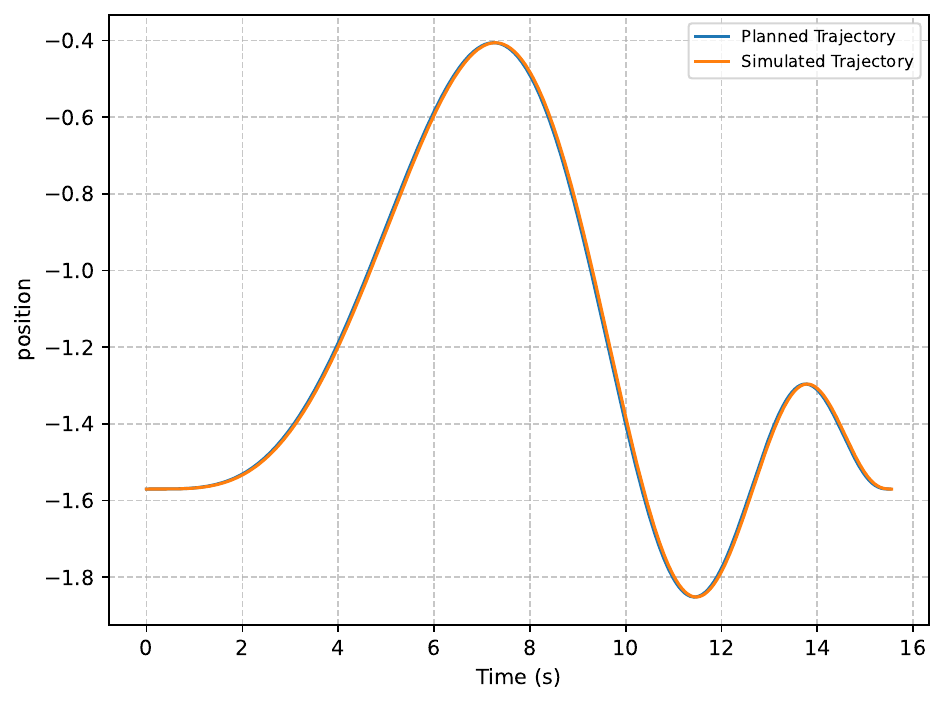
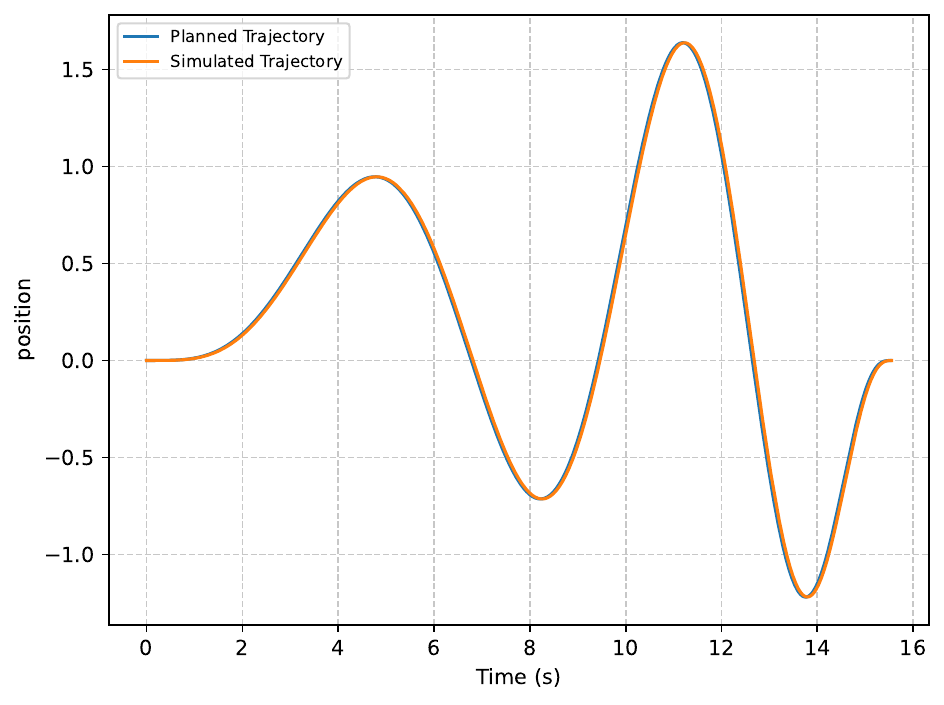

# trajecto

Multi-objective trajectory optimization for robot manipulators, built on
[Pinocchio](https://github.com/stack-of-tasks/pinocchio) (the `pin` package on
PyPI) for rigid-body dynamics and [pymoo](https://pymoo.org/) for the
multi-objective solver.

The optimization problem minimizes three objectives — trajectory **duration**,
**energy** (`∫|τ·ω| dt`), and **smoothness** (squared-jerk integral) — subject
to time, velocity, acceleration, jerk, and torque constraints.

## Installation

trajecto is managed with [uv](https://docs.astral.sh/uv/):

```bash
uv sync
```

Requires Python >= 3.11.

### Simulation requirements (optional)

Optimization (`Pipeline.optimize()`) only needs the dependencies installed by
`uv sync`. Running a trajectory in simulation (`Pipeline.run_simulation()`)
additionally requires a system ROS 2 installation with:

- `rclpy`, `launch`, `launch_ros`, `ament_index_python`
- `ros_gz_sim` / `ros_gz_bridge` (Gazebo ↔ ROS 2 bridge)
- `ros2_control` with `controller_manager` and a `joint_trajectory_controller`
- a robot description package (the example uses `ur_simulation_gz`)

These are not pip-installable and are imported lazily, so the optimization
pipeline works without them.

## Running in Docker

The repo ships a container image with everything `Pipeline.run_simulation()`
needs (ROS 2 Jazzy, Gazebo, ros2_control, `ur_simulation_gz`) plus the Python
dependencies installed from `uv.lock` — no ROS or Python setup on the host.

```bash
# build the base image (several GB on first build)
docker compose build

# start it
docker compose up -d

# run an example (ROS is sourced automatically in non-interactive shells)
docker compose exec ros2 bash -c "python3 examples/example.py"

# run the test suite inside the container (plugin autoload must be disabled:
# ROS's launch_testing pytest plugin targets an older pytest API)
docker compose exec ros2 bash -c "PYTEST_DISABLE_PLUGIN_AUTOLOAD=1 pytest -q"
```

The repository is bind-mounted at `/home/ros/ws` and `src/` is on
`PYTHONPATH`, so edits on the host take effect inside the container
immediately — no reinstall step.

Notes:

- **GPU**: the compose file reserves an NVIDIA GPU, so the host needs the
  [NVIDIA Container Toolkit](https://docs.nvidia.com/datacenter/cloud-native/container-toolkit/latest/install-guide.html).
  On a machine without it, delete the `deploy:` block (and the
  `NVIDIA_*`/`__GLX*`/`__NV_*` variables) from `docker-compose.yml`.
- **GUI**: for the Gazebo GUI, run `xhost +local:` on the host first and keep
  `DISPLAY` set. Without a display, use headless mode:
  `pipe.run_simulation(..., headless=True)` runs the Gazebo server only;
  data recording and plots are unaffected.
- **Networking**: `network_mode: host` and `ipc: host` require Docker on
  Linux (they don't work on Docker Desktop for macOS/Windows).

The uncommitted `docker-compose.override.yml` (gitignored) builds the
personal `dev` stage on top of the base image (editors, LSPs, shell tools).

## Usage

See [examples/example.py](examples/example.py) for the end-to-end pipeline on
a UR5: define a [`RobotConfig`](src/trajecto/config.py) and a `WorldConfig`,
define joint-space waypoints, pick a trajectory generator from
[`trajecto.samples`](src/trajecto/samples.py) (`bspline_trajectory`),
configure it via `trajectory_extras`, set `joint_limits`, then build a
`Pipeline` to optimize and run the trajectory in a Gazebo simulation:

```python
robot = RobotConfig(
    name="ur",
    urdf_source="package://ur_simulation_gz/urdf/ur_gz.urdf.xacro",
    xacro_args={"ur_type": "ur5", "name": "ur", "simulation_controllers": ...},
    controllers_yaml="...",
)
world = WorldConfig(name="torque_sensor", sdf_path="...")

pipe = Pipeline(
    robot=robot,
    world=world,
    trajectory=BSplineTrajectory(waypoints=waypoints, k=6, steps=500),
    joint_limits={"acceleration": np.full(6, 10.0), "jerk": np.full(6, 50.0)},
    time_limit=50,
    algorithm=MO_BWR(pop_size=100),  # MO_BWR comes from loares
    results_dir=...,
    seeds=[1, 2],
    n_gen=100,
    n_threads=8,
)
pipe.optimize()
pipe.run_simulation(trajectory_name="knee")  # requires the ROS 2 / Gazebo setup above
```

### Writing your own trajectory

A trajectory model is a subclass of
[`Trajectory`](src/trajecto/samples.py) (in the spirit of pymoo's `Problem`)
that implements `_generate(x)`. It carries its own optimization variables
(`n_var`) and `bounds`, and `__call__` validates the result, so a bad
implementation fails with a clear message rather than inside a worker.

```python
from trajecto.samples import Trajectory
import numpy as np

class MyTrajectory(Trajectory):
    def __init__(self, waypoints):
        self.waypoints = np.asarray(waypoints, float)
        super().__init__(n_var=len(waypoints) - 1,
                         bounds=np.array([[0.1] * (len(waypoints) - 1),
                                          [10.0] * (len(waypoints) - 1)]))

    def _generate(self, x):
        # x are the segment durations; return the trajectory dict
        ...
```

The returned dict must contain:

| key            | shape        | meaning                  |
| -------------- | ------------ | ------------------------ |
| `time`         | `(T,)`       | time stamps              |
| `position`     | `(T, n_joints)` | joint positions      |
| `velocity`     | `(T, n_joints)` | joint velocities     |
| `acceleration` | `(T, n_joints)` | joint accelerations  |
| `jerk`         | `(T, n_joints)` | joint jerks          |

Subclasses must be defined at module level (they are pickled to the joblib
worker processes). `BSplineTrajectory` is the shipped reference
implementation; `TrajectoryProblem.generate_trajectory(x)` returns the same
dict with `joint_names` and `torque` (from `pin.rnea`) added.

## Joint ordering contract

**All joint-ordered inputs must be supplied in URDF joint order** — i.e. the
order in which the movable joints are declared in the URDF:

- the **columns** of `waypoints`,
- the **columns** of the trajectory arrays returned by the trajectory
  function (`position`, `velocity`, `acceleration`, `jerk`),
- the per-joint entries of `joint_limits` (`velocity`, `acceleration`,
  `jerk`, `torque`).

`velocity` and `torque` limits are read automatically from the URDF `<limit>`
elements; `acceleration` and `jerk` are not defined in URDF and must be
supplied (via `joint_limits`). Supplying a key overrides the derived value.

Pinocchio's `buildModelFromXML` extracts joints deterministically in URDF
declaration order, and `trajecto` does **not** reorder anything: column `i` of
every trajectory array is assumed to correspond one-to-one to
`joint_names[i]` (see `TrajectoryProblem.joint_names`, which mirrors
`RobotModel.joint_names`). It is the user's responsibility to provide
waypoints, trajectory extras, and limits in that order.

To inspect the expected order for a given URDF:

```python
print(problem.joint_names)
# e.g. ['shoulder_pan_joint', 'shoulder_lift_joint', 'elbow_joint',
#       'wrist_1_joint', 'wrist_2_joint', 'wrist_3_joint']
```

`tests/test_problem.py` asserts the UR5 joint order and that trajectory
columns follow the waypoint/model order.

## Example results

Planned vs. simulated trajectories from the `examples/example.py` UR5 run
(selected Pareto solutions):

| `shoulder_pan_joint` | `shoulder_lift_joint` | `elbow_joint` |
| --- | --- | --- |
|  |  |  |

| `wrist_1_joint` | `wrist_2_joint` | `wrist_3_joint` |
| --- | --- | --- |
|  |  |  |

## Tests

```bash
uv run pytest
```
